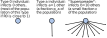
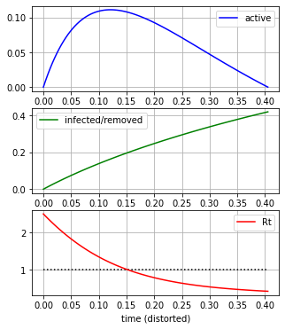

# Short description

This is a quick script to try to understand the effect of quarantine using random graphs with a toy degree distribution.
It is [runnable interactively](https://mybinder.org/v2/gh/valentas-kurauskas/heterogeneous-population-epidemics/master) in any browser via Binder.

The toy degree distribution allows exactly 3 types of individuals. A fraction *1-p_a-ε* of the population infects *0* new individuals.
A fraction *p_a* of them infects *a* new individuals. Finally, a fraction ε of the population infects a large number *b* of new individuals (they are "superspreaders"). We assume that the [basic reproduction number](https://en.wikipedia.org/wiki/Basic_reproduction_number) R0 is known and fixed, and adjust ε accordingly. 

For a completely mixed population with no immigration, basic theoretical models prove that if we manage to make R0 even slightly below 1 (by social distancing, hand and face hygiene, closures of places where a lot of people gather closely together, etc.), an epidemic ends infecting approximately **0%** of the population altogether. If R0 remains above one, unless stopped while there are just a few cases, an epidemic explodes and infects a significant fraction of the population.

When R0 is fixed (and R0 > 1), if most individuals observe quarantine, the same growth can only be sustained by those that don't or can't, let us call them "superspreaders". If this is the case (most individuals do not pass the infection on, but the initial growth is still fast), the final size of an epidemics (the largest component) may be smaller than the one predicted by the simple G(n,p) model corresponding to a completely homogeneous population (initial growth is the same but everyone equally ignores the quarantine, the green line in the plot).

 infect b, others infect 0")

For *G(n,p)* the blue line is the ["herd immunity threshold"](https://en.wikipedia.org/wiki/Herd_immunity#Mechanics) *1 - 1/R0*. If herd immunity is attained via "natural infection" as opposed to vaccination, the epidemics only begins to die out once this point is reached. The total infected fraction (the green line), or the fraction of vertices in the giant component, is quite a bit larger, it is the unique solution *ρ* of *1-ρ  = exp(-R0 ρ)* and *0 < ρ < 1*.

My intuition of the "superspreader effect" is that the superspreaders are more likely to get infected first so the *effective growth rate* *Rt* is largest at the beginning. This is indeed the case in our toy configuration graph model [[1]](#1), corresponding to *b=10* in the above chart (66.88% infect 0, 30.00% infect 1, 3.12% infect 10):

Here the time is (monotonically) transformed by the proof of [[1]](#1), it does not match the real time.
*y* axis in the first two subplots shows the proportion of the population. It can be seen that once the "herd immunity
threshold" *Rt=1* is hit, a large fraction of the population is still active (infectious), so unless a stricter quarantine
is enforced at this point, the epidemics still keeps growing for a while.

# Literature

<a id="1">[1]</a> Svante Janson and Malwina J. Luczak, *A new approach to the giant component problem*, Random Structures & Algorithms **34** (2009), 197-216.
